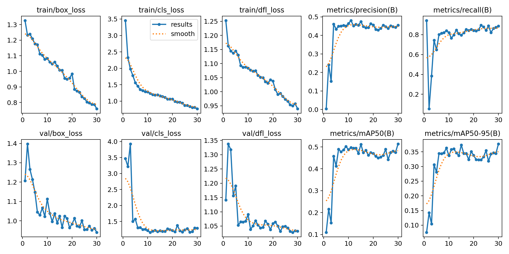
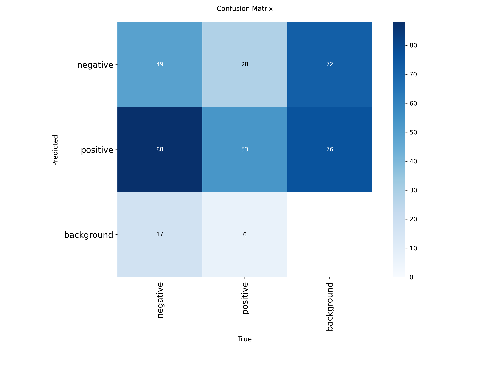
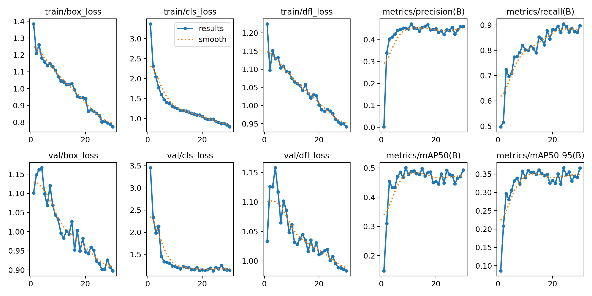
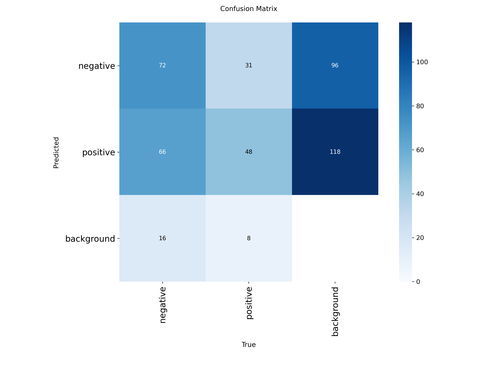
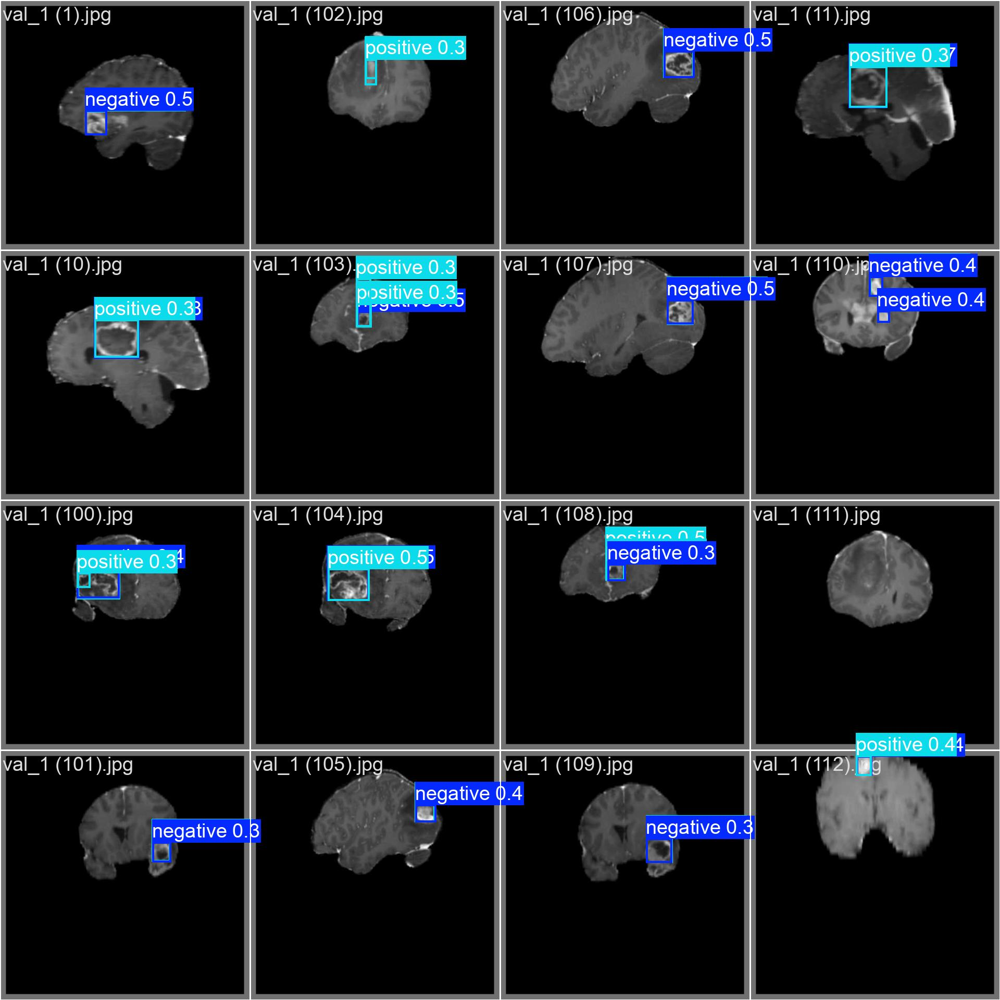
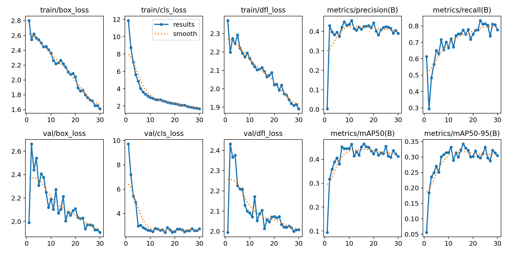
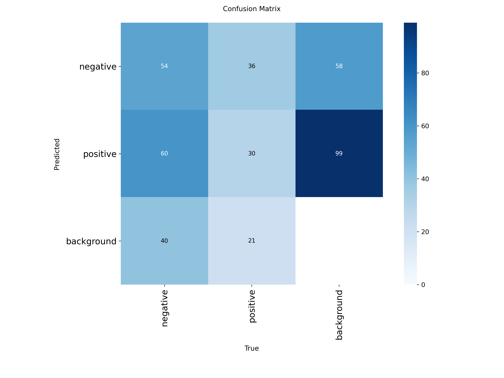
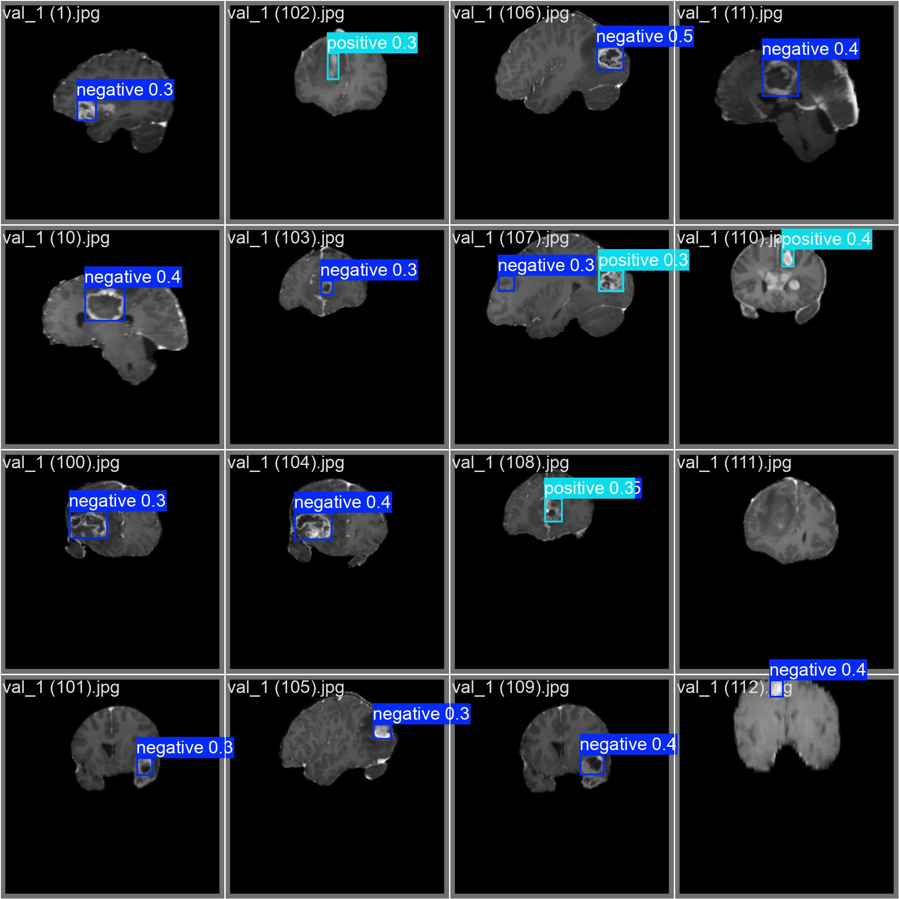

# 🧠 YOLO Modelleri ile Beyin Tümörü Tespiti

## 📋 Proje Hakkında

Bu çalışmada, Ultralytics platformunda yer alan **Brain Tumor** veri seti kullanılarak YOLOv8, YOLOv9 ve YOLOv10 mimarilerinin en küçük (lightweight) sürümleri ile deneyler gerçekleştirilmiştir.

Hesaplama maliyeti düşük ve hızlı çalışmaları nedeniyle **YOLOv8n** (Nano), **YOLOv9t** (Tiny) ve **YOLOv10n** (Nano) modelleri tercih edilmiştir. Amaç, sınırlı donanım kaynaklarında beyin tümörü tespiti performansını değerlendirmek ve hafif modellerin medikal görüntüler üzerindeki başarımını karşılaştırmaktır.

Tüm modeller, aynı eğitim ayarları ve Ultralytics Brain Tumor veri seti üzerinde eğitilerek adil bir karşılaştırma sağlanmıştır.

---

## Veri Seti Hakkında (Ultralytics Brain Tumor)

Bu projede kullanılan veri seti, Ultralytics tarafından sağlanan ve beyin tümörü tespiti (object detection) senaryoları için yaygın olarak kullanılan standart **Brain Tumor** veri setidir.

- **Kaynak:** Ultralytics (YOLO) Veri Setleri
- **İçerik:** Farklı açılardan çekilmiş Beyin MRI (Manyetik Rezonans Görüntüleme) taramaları.
- **Sınıf Yapısı:** 2 Sınıf
  - `positive`: Tümör tespit edilen bölge.
  - `negative`: Tümör bulunmayan sağlıklı doku/görüntü.
- **Veri Dağılımı:**
  - **Eğitim Seti (Train):** 893 Görüntü
  - **Doğrulama Seti (Val):** 223 Görüntü
    - **Toplam:** 1116 Görüntü

**Not:** Sonuç tablosunda gözlemlenen nispeten düşük Precision (Kesinlik) değerleri, `brain-tumor` veri setinin yapısından (zorluk derecesi, sınıf dengesi ve veri çeşitliliği) kaynaklanmaktadır. Bu durum medikal veri setlerinde yaygın karşılaşılan bir durumdur ve modellerin genel başarısını (mAP) doğrudan gölgelememelidir.

---

## Kullanılan Modellerin Referans Performansları (COCO)

Bu çalışmada, her mimarinin en düşük parametreli ve en hızlı versiyonları tercih edilmiştir. Aşağıdaki tablolar, modellerin standart COCO veri seti üzerindeki referans performanslarını göstermektedir:

### YOLOv8n (Nano)

| Model       | Size (pixels) | mAPval 50-95 | Speed CPU ONNX (ms) | Speed A100 TensorRT (ms) | Params (M) | FLOPs (B) |
| ----------- | ------------- | ------------ | ------------------- | ------------------------ | ---------- | --------- |
| **YOLOv8n** | 640           | 37.3         | 80.4                | 0.99                     | 3.2        | 8.7       |

### YOLOv9t (Tiny)

| Model       | Size (pixels) | mAPval 50-95 | mAPval 50 | Params (M) | FLOPs (B) |
| ----------- | ------------- | ------------ | --------- | ---------- | --------- |
| **YOLOv9t** | 640           | 38.3         | 53.1      | 2.0        | 7.7       |

### YOLOv10n (Nano)

| Model        | Input Size | APval | FLOPs (G) | Latency (ms) |
| ------------ | ---------- | ----- | --------- | ------------ |
| **YOLOv10n** | 640        | 38.5  | 6.7       | 1.84         |

---

## 🎯 Performans Karşılaştırması

### Son Sonuçlar (30. Epoch)

| Model        | mAP50     | mAP50-95  | Precision | Recall    | Parametre | Inference Hızı (T4 GPU) |
| ------------ | --------- | --------- | --------- | --------- | --------- | ----------------------- |
| **YOLOv9t**  | **0.513** | **0.376** | **0.455** | 0.887     | ~1.97M    | 5.4ms                   |
| **YOLOv8n**  | 0.493     | 0.368     | 0.447     | **0.891** | ~3.01M    | **2.6ms**               |
| **YOLOv10n** | 0.464     | 0.341     | 0.424     | 0.775     | ~2.27M    | 2.8ms                   |

---

## 📊 Detaylı Sonuçlar

### 1️⃣ YOLOv9t (Tiny) Sonuçları

_En Yüksek Doğruluk (mAP)_

- **Model Özeti:** 197 katman, 1,971,174 parametre, 7.6 GFLOPs
- **Hız:** 5.4ms inference
- **Eğitim Süresi:** ~10.7 dakika
- **Performans:** mAP50 skorunda **0.513** ile en iyi sonucu vermiştir. Precision (Kesinlik) değeri de en yüksektir.

| Class    | Images | Instances | Box(P) | R     | mAP50 | mAP50-95 |
| -------- | ------ | --------- | ------ | ----- | ----- | -------- |
| all      | 223    | 241       | 0.455  | 0.887 | 0.513 | 0.376    |
| negative | 142    | 154       | 0.598  | 0.831 | 0.612 | 0.461    |
| positive | 81     | 87        | 0.312  | 0.943 | 0.414 | 0.291    |

<details>
<summary><b>📈 YOLOv9t Görsel Sonuçları (Tıklayın)</b></summary>

| Eğitim Grafikleri                                            | Karışıklık Matrisi                                                   |
| ------------------------------------------------------------ | -------------------------------------------------------------------- |
|  |  |

**Örnek Tahminler:**


</details>

---

### 2️⃣ YOLOv8n (Nano) Sonuçları

_En Yüksek Yakalama Oranı (Recall) ve Hız_

- **Model Özeti:** 72 katman, 3,006,038 parametre, 8.1 GFLOPs
- **Hız:** **2.6ms** inference (En Hızlı)
- **Eğitim Süresi:** ~8.0 dakika (En Hızlı Eğitim)
- **Performans:** **0.891 Recall** değeri ile tümörleri kaçırmama konusunda en başarılı modeldir. Ayrıca inference süresi olarak en hızlı tepki veren modeldir.

| Class    | Images | Instances | Box(P) | R     | mAP50 | mAP50-95 |
| -------- | ------ | --------- | ------ | ----- | ----- | -------- |
| all      | 223    | 241       | 0.447  | 0.891 | 0.493 | 0.368    |
| negative | 142    | 154       | 0.586  | 0.863 | 0.621 | 0.473    |
| positive | 81     | 87        | 0.308  | 0.920 | 0.365 | 0.262    |

<details>
<summary><b>📈 YOLOv8n Görsel Sonuçları (Tıklayın)</b></summary>

| Eğitim Grafikleri                                            | Karışıklık Matrisi                                                   |
| ------------------------------------------------------------ | -------------------------------------------------------------------- |
|  |  |

**Örnek Tahminler:**


</details>

---

### 3️⃣ YOLOv10n (Nano) Sonuçları

_Dengeli ve Hafif_

- **Model Özeti:** 102 katman, 2,265,558 parametre, 6.5 GFLOPs
- **Hız:** 2.8ms inference
- **Eğitim Süresi:** ~9.6 dakika
- **Performans:** YOLOv8n ile yarışan bir inference hızına sahip olsa da, bu veri setinde mAP ve Recall değerlerinde diğer modellerin biraz gerisinde kalmıştır.

| Class    | Images | Instances | Box(P) | R     | mAP50 | mAP50-95 |
| -------- | ------ | --------- | ------ | ----- | ----- | -------- |
| all      | 223    | 241       | 0.424  | 0.775 | 0.464 | 0.341    |
| negative | 142    | 154       | 0.531  | 0.688 | 0.554 | 0.414    |
| positive | 81     | 87        | 0.317  | 0.862 | 0.374 | 0.268    |

<details>
<summary><b>📈 YOLOv10n Görsel Sonuçları (Tıklayın)</b></summary>

| Eğitim Grafikleri                                              | Karışıklık Matrisi                                                     |
| -------------------------------------------------------------- | ---------------------------------------------------------------------- |
|  |  |

**Örnek Tahminler:**


</details>

---

## 🏆 Model Analizi ve Öneriler

### 🥇 En Doğru Model: YOLOv9t

Eğer önceliğiniz **doğruluk (Accuracy)** ise, **YOLOv9t** en iyi tercihtir.

- ✅ **0.513 mAP50** ile en yüksek tespit başarısı.
- ✅ **0.455 Precision** ile yanlış alarm oranı en düşük.
- ✅ Parametre sayısı bakımından en kompakt model (~1.97M).

### ⚡ En Hızlı ve Duyarlı: YOLOv8n

Eğer önceliğiniz **hız** ve **gözden kaçırmamak (Recall)** ise, **YOLOv8n** öne çıkmaktadır.

- ✅ **0.891 Recall** ile tümörlerin %89'undan fazlasını yakalıyor. Medikal taramalarda gözden kaçırmamak önemlidir.
- ✅ **2.6ms** ile en hızlı inference süresine sahip.
- ✅ En hızlı eğitilen model (~8 dk).

### 💡 Sonuç

- **Klinik doğruluk** için **YOLOv9t** önerilir.
- **Mobil/Gerçek zamanlı tarama** ve minimum kaçırma (maksimum sensitivite) için **YOLOv8n** önerilir.

---

## 📁 Proje Klasör Yapısı

Eğitim çıktılarınız şu klasör yapısında organize edilmiştir:

```
BrainTumor_Project(egitim_sonuclari)/
├── yolov9t_run/                # YOLOv9t sonuçları
│   ├── weights/
│   │   ├── best.pt             # En iyi ağırlıklar
│   │   └── last.pt             # Son epoch ağırlıkları
│   ├── results.png             # Performans grafikleri
│   ├── confusion_matrix.png    # Karışıklık matrisi
│   ├── val_batch0_pred.jpg     # Tahmin örnekleri
│   └── ...
│
├── yolov8n_run/                # YOLOv8n sonuçları
│   └── ... (aynı yapı)
│
└── yolov10n_run/               # YOLOv10n sonuçları (Not: Proje adı training kodunda farklı olabilir)
    └── ... (aynı yapı)
```

## 🚀 Nasıl Kullanılır?

Test etmek veya tahmin (inference) yapmak için aşağıdaki kodları kullanabilirsiniz:

```python
from ultralytics import YOLO

# Modeli yükle (Örnek: YOLOv9t)
model = YOLO("egitim_sonuclari/yolov9t_run/weights/best.pt")

# Bir görüntü üzerinde tahmin yap
results = model.predict("test_images/tumor_sample.jpg", save=True, imgsz=640, conf=0.25)

# Sonuçları göster
results[0].show()
```

---
